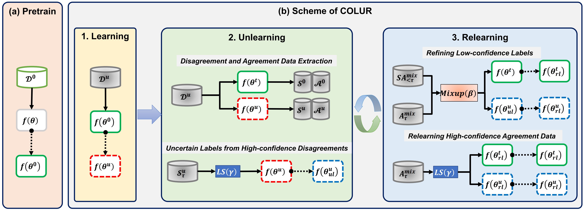

# COLUR: Learning, Unlearning and Relearning from Data with Uncertain Labels via Model Confidence Refinement

<div align="center">

 [:sparkles: Overview](#sparkles-overview) | [:computer: Usage](#computer-usage) | [:thinking: Insight](#thinking-insight) | [:link: Cite](#link-cite)

<div align="left">

<!-- ADD WARNING: 只保留了核心代码，如有需要，会提供 baseline 复现、结果分析的jupyter notebook等代码以及训练好的模型。 -->

## :sparkles: Overview

<!-- insert the pdf of framework from assets/framework.pdf -->
</img>

## :computer: Usage

### :rainbow: Environment

```bash
conda create -n ${env_name} -r requirements.txt
```

### :rocket: Generate Dataset

#### :zap: Generate symmetric noise

Different ratios of symmetric noises are injected into Cifar-10 and Flower-102 dataset.

```bash
# CIFAR-10
PYTHONPATH=${code_base} python gen_dataset/gen_cifar10_exp_data_cvpr.py \
--dataset_name cifar-10 \
--data_dir ./data/cifar-10/normal \
--gen_dir ./data/cifar-10/gen \
--split_ratio 0.4 \
--noise_type symmetric \
--noise_ratio 0.1
```

```bash
# Flower-102
PYTHONPATH=${code_base} python gen_dataset/gen_flower102_exp_data_cvpr.py \
--dataset_name flower-102 \
--data_dir ./data/flower-102/normal/flowers-102/ \
--gen_dir ./data/flower-102/gen \
--split_ratio 0.4 \
--noise_type symmetric \
--noise_ratio 0.1
```

`split_ratio` for different dataset may vary.
`noise_ratio` may be 0.1/0.25/0.5/0.75/0.9.

#### :zap: Generate asymmetric noise

Different ratios of symmetric noises are injected into Cifar-100 and Oxford-IIIT Pet dataset.

```bash
# CIFAR-100
PYTHONPATH=${code_base} python gen_dataset/gen_cifar100_exp_data_cvpr.py \
--dataset_name cifar-100 \
--data_dir ./data/cifar-100/normal \
--gen_dir ./data/cifar-100/gen \
--split_ratio 0.6 \
--noise_type asymmetric \
--noise_ratio 0.1
```

```bash
# Oxford-IIIT Pet
PYTHONPATH=${code_base} python gen_dataset/gen_pet37_exp_data_cvpr.py \
--dataset_name pet-37 \
--data_dir ./data/pet-37/normal/oxford-pets \
--gen_dir ./data/pet-37/gen \
--split_ratio 0.3 \
--noise_type asymmetric \
--noise_ratio 0.1
```

`split_ratio` for different dataset may vary.
`noise_ratio` may be 0.1/0.25/0.5/0.75/0.9.

### :fire: Pre-Train

**Pre-train on CIFAR-10.**

```bash
CUDA_VISIBLE_DEVICES=${CUDA_DEVICE_NUM} python ./run_experiment_cvpr.py \
--model efficientnet_s \
--dataset cifar-10 \
--num_epochs 30 \
--train_mode pretrain \
--learning_rate 1e-3 \
--optimizer adam \
--batch_size 256 \
```

**Pre-train on Flower-102.**

```bash
CUDA_VISIBLE_DEVICES=${CUDA_DEVICE_NUM} python ./run_experiment_cvpr.py \
--model wideresnet50 \
--dataset flower-102 \
--num_epochs 20 \
--train_mode pretrain \
--learning_rate 1e-3 \
--optimizer adam \
--batch_size 256

```

**Pre-train on CIFAR-100.**

```bash
CUDA_VISIBLE_DEVICES=${CUDA_DEVICE_NUM} python run_experiment_cvpr.py \
--model efficientnet_s \
--dataset cifar-100 \
--num_epochs 400 \
--train_mode pretrain \
--learning_rate 2e-4 \
--optimizer adam \
--batch_size 256 \
--data_aug
```

**Pre-train on Oxford-IIIT Pet.**

```bash
CUDA_VISIBLE_DEVICES=${CUDA_DEVICE_NUM} python ./run_experiment_cvpr.py \
--model wideresnet50 \
--dataset pet-37 \
--num_epochs 15 \
--train_mode inc_train \
--learning_rate 2e-5 \
--optimizer adam \
--batch_size 16 \
--noise_type asymmetric \
--noise_ratio 0.1
```

### :fire: Inc-Train

#### :zap: Incremental training models on symmetric dataset

**Inc-train on CIFAR-10.**

```bash
CUDA_VISIBLE_DEVICES=${CUDA_DEVICE_NUM} python ./run_experiment_cvpr.py \
--model efficientnet_s \
--dataset cifar-10 \
--num_epochs 30 \
--train_mode inc_train \
--learning_rate 1e-4 \
--optimizer adam \
--batch_size 256 \
--noise_type symmetric \
--noise_ratio 0.1
```

`noise_ratio` may be 0.1/0.25/0.5/0.75/0.9.

**Inc-train on Flower-102.**

```bash
CUDA_VISIBLE_DEVICES=${CUDA_DEVICE_NUM} python ./run_experiment_cvpr.py \
--model wideresnet50 \
--dataset flower-102 \
--num_epochs 15 \
--train_mode inc_train \
--learning_rate 1e-3 \
--optimizer adam \
--batch_size 256 \
--noise_type symmetric \
--noise_ratio 0.1
```

`noise_ratio` may be 0.1/0.25/0.5/0.75/0.9.

#### :zap: Incremental training models on asymmetric dataset

**Inc-train on CIFAR-100.**

```bash
CUDA_VISIBLE_DEVICES=${CUDA_DEVICE_NUM} python ./run_experiment_cvpr.py \
--model efficientnet_s \
--dataset cifar-100 \
--num_epochs 50 \
--train_mode inc_train \
--learning_rate 1e-4 \
--optimizer adam \
--batch_size 256 \
--noise_type asymmetric \
--noise_ratio 0.1
```

`noise_ratio` may be 0.1/0.25/0.5/0.75/0.9.

**Inc-train on Oxford-IIIT Pet.**

```bash
CUDA_VISIBLE_DEVICES=${CUDA_DEVICE_NUM} python ./run_experiment_cvpr.py \
--model wideresnet50 \
--dataset pet-37 \
--num_epochs 15 \
--train_mode inc_train \
--learning_rate 2e-5 \
--optimizer adam \
--batch_size 16 \
--noise_type asymmetric \
--noise_ratio 0.1
```

`noise_ratio` may be 0.1/0.25/0.5/0.75/0.9.

### :zap: Executing Baselines

```bash

```

### :hammer: Check results

```bash
# cd your data directory
tree $DATA_DIR

# cd your model directory
tree $MODEL_DIR
```

### :bar_chart: Evaluation

```bash
cd data_process
python load_acc.py
```

```bash
cd data_process
python load_lip_acc.py
```

## :scroll: License

This repository respects to MIT license.
